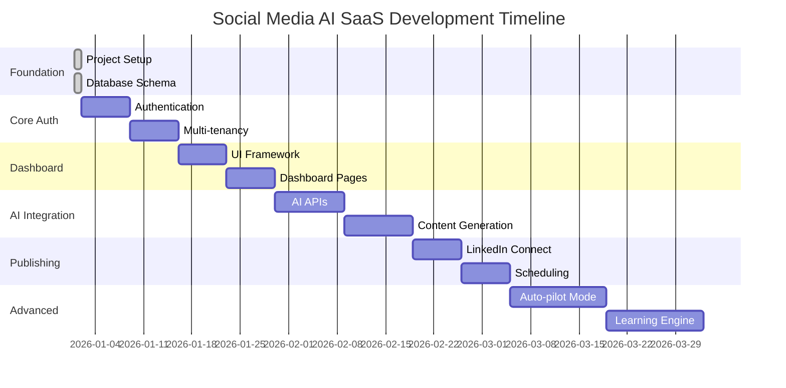

# 📋 Development TODO & Roadmap

**Current Status**: Foundation MVP Complete (30%) 🏗️
**Next Priority**: Authentication System 🔐

---

## 🎯 **Immediate Priorities (Week 1-2)**

### **🔐 1. Authentication System (HIGH PRIORITY)**
```typescript
// Implementation needed:
- [ ] NextAuth.js configuration
- [ ] Login/Register pages with UI
- [ ] Protected route middleware
- [ ] JWT token validation
- [ ] Password reset functionality
- [ ] Email verification (optional)
```

**Files to create:**
- `src/app/api/auth/[...nextauth]/route.ts`
- `src/app/login/page.tsx`
- `src/app/register/page.tsx`
- `src/lib/auth.ts`
- `src/middleware.ts`

### **👥 2. Multi-Tenant User Management**
```typescript
// Implementation needed:
- [ ] Tenant registration flow
- [ ] User invitation system
- [ ] Role-based permissions (RBAC)
- [ ] Team member management UI
- [ ] Tenant switching functionality
```

**Database ready**: ✅ Schema exists, needs API implementation

---

## 🚀 **Core Features (Week 3-6)**

### **📊 3. Dashboard Implementation**
```typescript
// Priority features:
- [ ] Dashboard layout with sidebar navigation
- [ ] Stats cards (posts, engagement, AI usage)
- [ ] Recent activity feed
- [ ] Quick action buttons
- [ ] Mobile-responsive design
```

**Files to create:**
- `src/app/dashboard/layout.tsx`
- `src/app/dashboard/page.tsx`
- `src/components/dashboard/sidebar.tsx`
- `src/components/dashboard/stats-cards.tsx`

### **🤖 4. AI Integration & Configuration**
```typescript
// Implementation priorities:
- [ ] OpenAI client setup and error handling
- [ ] Claude 3 integration
- [ ] AI model selection UI
- [ ] Brand voice configuration
- [ ] Confidence scoring system
- [ ] Rate limiting and usage tracking
```

**Files to create:**
- `src/lib/ai/openai.ts`
- `src/lib/ai/anthropic.ts`
- `src/app/dashboard/ai-config/page.tsx`
- `src/app/api/ai/generate/route.ts`

### **🎨 5. Brand Asset Management**
```typescript
// Logo & watermarking system:
- [ ] File upload with drag-and-drop
- [ ] AWS S3 integration for storage
- [ ] Image processing (resize, format conversion)
- [ ] Watermarking position settings
- [ ] Logo library management
- [ ] Preview functionality
```

**Files to create:**
- `src/lib/s3.ts`
- `src/app/dashboard/brand/page.tsx`
- `src/app/api/upload/route.ts`
- `src/components/brand/logo-upload.tsx`

---

## 📱 **Content Management (Week 7-10)**

### **📝 6. Content Creation Workflow**
```typescript
// Core content features:
- [ ] Media upload interface
- [ ] AI content generation from images/videos
- [ ] Manual text editing with real-time preview
- [ ] Hashtag suggestions and management
- [ ] Post approval workflow
- [ ] Draft management system
```

### **📅 7. Calendar & Scheduling**
```typescript
// Scheduling system:
- [ ] Calendar view (monthly/weekly)
- [ ] Drag-and-drop post scheduling
- [ ] Optimal timing suggestions
- [ ] Bulk scheduling capabilities
- [ ] Time zone handling
- [ ] Recurring posts
```

### **🔗 8. LinkedIn Integration**
```typescript
// Social platform connection:
- [ ] LinkedIn OAuth flow
- [ ] Profile connection management
- [ ] Post publishing API
- [ ] Publishing queue with retry logic
- [ ] Error handling and notifications
- [ ] Analytics integration
```

---

## 🧠 **Advanced AI Features (Week 11-16)**

### **🚁 9. Auto-Pilot Mode**
```typescript
// Automated content generation:
- [ ] Bulk content generation
- [ ] Confidence-based filtering
- [ ] Automated scheduling
- [ ] Email notifications for approvals
- [ ] Performance monitoring
- [ ] A/B testing framework
```

### **📈 10. AI Learning Engine**
```typescript
// Machine learning implementation:
- [ ] User feedback capture system
- [ ] Pattern recognition algorithms
- [ ] Model fine-tuning pipeline
- [ ] Preference learning dashboard
- [ ] Performance improvement tracking
- [ ] Rollback capabilities
```

### **🌐 11. Website Analysis & Intelligence**
```typescript
// Competitor & brand analysis:
- [ ] Website scraping with Playwright
- [ ] Brand color/font extraction
- [ ] Competitor monitoring setup
- [ ] RSS feed integration
- [ ] Content opportunity detection
- [ ] Industry trend analysis
```

---

## 💼 **Business Features (Week 17-20)**

### **💳 12. Payment & Subscription System**
```typescript
// Revenue implementation:
- [ ] Stripe integration
- [ ] Subscription plan management
- [ ] Usage-based billing
- [ ] Invoice generation
- [ ] Payment failure handling
- [ ] Plan upgrade/downgrade flow
```

### **📊 13. Analytics & Reporting**
```typescript
// Performance tracking:
- [ ] Engagement analytics
- [ ] AI performance metrics
- [ ] User behavior tracking
- [ ] Custom report generation
- [ ] Export functionality
- [ ] ROI calculations
```

### **🔧 14. Admin Panel**
```typescript
// Super admin features:
- [ ] Tenant management
- [ ] Usage monitoring
- [ ] AI model performance tracking
- [ ] System health dashboard
- [ ] User support tools
- [ ] Feature flag management
```

---

## 🚀 **Nice-to-Have Features (Future)**

### **📱 15. Mobile App (React Native)**
- [ ] Cross-platform mobile app
- [ ] Push notifications
- [ ] Offline content creation
- [ ] Camera integration
- [ ] Voice-to-text features

### **🌍 16. Additional Platforms**
- [ ] Twitter/X integration
- [ ] Facebook/Instagram integration
- [ ] TikTok Business integration
- [ ] YouTube Shorts publishing
- [ ] Multi-platform scheduling

### **🤖 17. Advanced AI Features**
- [ ] Custom AI model training
- [ ] Voice generation for videos
- [ ] Advanced image editing
- [ ] Video content generation
- [ ] Multilingual content support

---

## 🔧 **Technical Improvements**

### **⚡ Performance Optimization**
```typescript
- [ ] Database query optimization
- [ ] Redis caching implementation
- [ ] CDN setup for media files
- [ ] Image optimization pipeline
- [ ] API response caching
- [ ] Bundle size optimization
```

### **🔒 Security Enhancements**
```typescript
- [ ] Rate limiting middleware
- [ ] Input validation with Zod
- [ ] SQL injection prevention
- [ ] CORS policy refinement
- [ ] Security headers
- [ ] Vulnerability scanning
```

### **🧪 Testing & Quality**
```typescript
- [ ] Unit tests with Jest
- [ ] Integration tests
- [ ] E2E tests with Playwright
- [ ] API testing with Supertest
- [ ] Performance testing
- [ ] Accessibility compliance
```

---

## 📦 **Infrastructure & DevOps**

### **🚀 Deployment Pipeline**
```bash
- [ ] GitHub Actions CI/CD
- [ ] Staging environment setup
- [ ] Blue-green deployment
- [ ] Database migration automation
- [ ] Environment variable management
- [ ] Rollback procedures
```

### **📊 Monitoring & Observability**
```bash
- [ ] Application performance monitoring (APM)
- [ ] Error tracking with Sentry
- [ ] Log aggregation
- [ ] Uptime monitoring
- [ ] Alert system setup
- [ ] Performance metrics dashboard
```

---

## 📋 **Code Quality & Documentation**

### **📝 Documentation**
```markdown
- [x] README.md (Complete)
- [x] QUICK_START.md (Complete)
- [x] RAILWAY_DEPLOY.md (Complete)
- [ ] API_DOCS.md (In Progress)
- [ ] CONTRIBUTING.md (Needed)
- [ ] CHANGELOG.md (Needed)
- [ ] User documentation
- [ ] Admin documentation
```

### **🔧 Code Standards**
```typescript
- [ ] ESLint configuration refinement
- [ ] Prettier setup
- [ ] Husky pre-commit hooks
- [ ] TypeScript strict mode
- [ ] Code coverage requirements
- [ ] Component documentation
```

---

## 🎯 **Success Metrics & KPIs**

### **Technical KPIs:**
- [ ] **Response Time**: < 200ms average API response
- [ ] **Uptime**: 99.9% availability target
- [ ] **AI Accuracy**: > 85% user satisfaction
- [ ] **Database Performance**: < 100ms query time
- [ ] **Error Rate**: < 0.1% application errors

### **Business KPIs:**
- [ ] **User Retention**: 80%+ monthly retention
- [ ] **Time to Value**: < 5 minutes onboarding
- [ ] **Customer Satisfaction**: 4.5+ star rating
- [ ] **Revenue Growth**: 20% month-over-month
- [ ] **Support Tickets**: < 2% of active users

---

## 📅 **Development Timeline**



---

## 🏆 **Success Criteria**

### **MVP Success (End of Month 1):**
- [ ] User registration and authentication working
- [ ] Basic AI content generation functional
- [ ] LinkedIn posting capability
- [ ] Calendar scheduling interface
- [ ] At least 10 paying customers

### **Product-Market Fit (End of Month 3):**
- [ ] 100+ active tenants
- [ ] 80%+ monthly retention rate
- [ ] AI accuracy > 85% satisfaction
- [ ] Revenue > €5,000/month
- [ ] NPS score > 50

### **Scale Success (End of Month 6):**
- [ ] 500+ active tenants
- [ ] Auto-pilot mode generating 10,000+ posts/month
- [ ] Revenue > €25,000/month
- [ ] Team scaling plan in place
- [ ] Series A funding secured (optional)

---

## 🤝 **Team & Responsibilities**

### **Current Team (AI MINDLOOP SRL):**
- **Founder/CEO**: DOREL - Product vision, business development
- **Development**: To be hired - Full-stack developer needed
- **AI/ML**: Consultant or part-time specialist
- **Design**: Freelancer for UI/UX improvements

### **Immediate Hiring Needs:**
1. **Senior Full-Stack Developer** (Next.js + Node.js)
2. **Part-time AI/ML Engineer** (Python + OpenAI/Anthropic)
3. **UI/UX Designer** (Figma + React components)

---

## 📞 **Support & Resources**

**Internal Resources:**
- Project documentation in `/docs`
- Development guidelines in `CONTRIBUTING.md`
- API reference in `API_DOCS.md`

**External Support:**
- Next.js documentation
- Prisma guides
- Railway deployment docs
- OpenAI API reference

---

**🚀 Ready to build the future of social media automation!**

**Made with ❤️ by AI MINDLOOP SRL | Romania 🇷🇴**